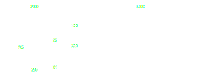

# M-N-Kappa

Implementation of the *M*-*N*-*&#954;* method for deformation-computation of structural beams 
considering multi-line material models as well as shear connector behaviour implemented in 
[python](https://www.python.org/).

## Introduction
The ``m_n_kappa``-package addresses primarily scientific investigations in structural engineering.
It has been developed having steel-concrete composite beams, i.e. slim-floor beams in mind, 
but due to its general approach using multiline material models the scope of application is potentially
much greater.

- *M*: resistance moment of a cross-section 
- *N*: internal shear-force applied with differing sign on the concrete-slab 
  and the steel-girder
- *&#954;*: the curvature over the cross-section4

It is assumed that the curvature *&#954;* is uniformly distributed over the 
full height of the cross-section. 

The *M*-*&#954;*-Method allows to compute the deformation of composite beams assuming 
rigid shear connection. 
The *M*-*N*-*&#954;*-Method extends the method by the load-slip-behaviour of the shear 
connectors. 

## Features
The following list is an extract of the given and potential features 

- strain-based design 
- consideration of 
  [effective width for concrete slabs](https://johannesschorr.github.io/M-N-Kappa/theory/effective_widths.html)
  distinguishing between membran and bending loading
- consideration of load-slip behaviour of shear connectors (not yet implemented)
- easy to use interface (see [Example](#example-computing-a-steel-girder))

## Installation
The installation via [PyPi](https://pypi.org/) runs as follows.
```
pip install m_n_kappa
```

## Example: Computing a steel-concrete composite beam
The following example shows how easy and straightforward ``m_n_kappa`` is applied to 
computing the deformation of a composite beam.



The slab is a rectangle of concrete of type C30/35.
```python
from m_n_kappa import Rectangle, Concrete
slab = Rectangle(top_edge=0.0, bottom_edge=100, width=2000)
concrete = Concrete(f_cm=38)
concrete_slab = concrete + slab
```
The girder is a HEB 200 steel-profile of type S355.
````python
from m_n_kappa import IProfile, Steel
girder = IProfile(top_edge=100.0, t_w=9.5, h_w=200-2*15, t_fo=15, b_fo=200)
steel = Steel(f_y=355, failure_strain=0.15)
steel_girder = steel + girder
````
Merging the ``concrete_slab`` and the ``steel_girder`` to a composite cross-section
is accomplished also easily.
````python
composite_cross_section = concrete_slab + steel_girder
````
This ``Crosssection``-object of a composite beam allows you to do several things like
computing the curvature *&#954;*, the *M*-*&#954;*-curve or the deformation of the beam
under a given loading. 
```python
from m_n_kappa import SingleSpanUniformLoad, Beam
loading = SingleSpanUniformLoad(length=8000, load=1.0)
beam = Beam(
    cross_section=composite_cross_section, 
    length=8000, 
    element_number=10,
    load=loading
)
deformation_at_maximum_position = beam.deformations_at_maximum_deformation_position()
deformation_at_maximum_position.values()
```
If you want to know more please refer to the [Documentation](https://johannesschorr.github.io/M-N-Kappa/).

## Documentation

The documentation gives you more [examples](https://johannesschorr.github.io/M-N-Kappa/examples/index.html), 
let's you understand the mechanics working under the hood in the 
[Theory guide](https://johannesschorr.github.io/M-N-Kappa/theory/index.html)
or shows you application of the model on tests in 
[Verification](https://johannesschorr.github.io/M-N-Kappa/verification/index.html).

Overview:
- [Getting started](https://johannesschorr.github.io/M-N-Kappa/getting_started.html)
- [Examples](https://johannesschorr.github.io/M-N-Kappa/examples/index.html)
- [Theory guide](https://johannesschorr.github.io/M-N-Kappa/theory/index.html)
- [Verification](https://johannesschorr.github.io/M-N-Kappa/verification/index.html)

## Contributions are highly appreciated
- Did you find a typo, a bug or want to add an explanation or figure to the documentation?
- Do you want to implement another [material model](https://johannesschorr.github.io/M-N-Kappa/api/m_n_kappa.Material.html),
  enhance the performance or implement another [feature](https://johannesschorr.github.io/M-N-Kappa/roadmap.html#roadmap-roadmap)?
- You used ``m_n_kappa`` to compute the load-deformation behaviour of your experimental investigation and want to share
  your [verification](https://johannesschorr.github.io/M-N-Kappa/verification/index.html)?

All types of contributions are welcomed. 
Please check beforehand the [Contributing](https://johannesschorr.github.io/M-N-Kappa/contributing.html)'s page. 

## About 
- [Roadmap](https://johannesschorr.github.io/M-N-Kappa/roadmap.html): 
  Roadmap, ideas for implementation and To do's
- [License](https://johannesschorr.github.io/M-N-Kappa/license.html): 3-Clause BSD License
- [Release Notes](https://johannesschorr.github.io/M-N-Kappa/whatsnew/index.html)