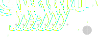

.. _examples.geometry:

Creating Geometries
*******************

By the following sections you learn how to create your own geometries
and what you have to consider while creating it.

.. _examples.geometry.basis.coordinates:

Directions and coordinates
==========================
.. figure:: ../images/coordinates-dark.svg
   :class: only-dark
.. figure:: ../images/coordinates-light.svg
   :class: only-light

   Axes

In `cartesian coordinates <https://en.wikipedia.org/wiki/Cartesian_coordinate_system>`_
the span direction is denoted as X-axis.

Y- and Z-axis are the cross-sectional plane.
Where the Y-axis is the horizontal axis and the Z-axis describes the
vertical axis.
The Z-axis is defined in reverse order, meaning from top to bottom.
Therefore, a higher value means a point at lower level.

.. seealso::
   :ref:`theory.coordinates` : Coordinates in the :ref:`theory`

Following descriptions apply universally:

- `top_edge`: distance between origin and top-edge of the geometric entity in vertical direction
- `bottom_edge`: distance between origin and bottom-edge of the geometric entity in vertical direction
- `left_edge`: distance between origin and left edge of the geometric entity in horizontal direction
- `right_edge`: distance between origin and right edge of the geometric entity in horizontal direction
- `centroid_y`: distance between origin and centroid of the geometry in **horizontal** direction
- `centroid_z`: distance between origin and centroid of the geometry in **vertical** direction

.. _examples.geometry.basis:

The basics: Rectangle, Trapezoid and Circles
============================================
:py:class:`~m_n_kappa.Rectangle`, :py:class:`~m_n_kappa.Trapezoid`
and :py:class:`~m_n_kappa.Circle` are available as basic geometric entities
for creating individual geometries.

.. _examples.geometry.basis.rectangle:

Rectangle and Trapezoid
-----------------------
.. figure:: ../images/geometry_rectangle-dark.svg
   :class: only-dark
.. figure:: ../images/geometry_rectangle-light.svg
   :class: only-light

   Rectangle dimensions

For a :py:class:`~m_n_kappa.Rectangle` as well as a :py:class:`~m_n_kappa.Trapezoid`
always the ``top_edge`` and the ``bottom_edge`` need to be defined.
The width and the horizontal positioning in Y-direction may be defined in
several ways.
All of the following are the same in size and position.

>>> from m_n_kappa import Rectangle
>>> rectangle_1 = Rectangle(
...     top_edge=0.0, bottom_edge = 10.0, width=10.0, left_edge=-5.0)
>>> rectangle_2 = Rectangle(
...     top_edge=0.0, bottom_edge = 10.0, width=10.0, right_edge=5.0)
>>> rectangle_3 = Rectangle(
...     top_edge=0.0, bottom_edge = 10.0, left_edge=-5.0, right_edge=5.0)
>>> rectangle_4 = Rectangle(
...     top_edge=0.0, bottom_edge = 0.0, width=10.0)

.. figure:: ../images/geometry_trapezoid-dark.svg
   :class: only-dark
.. figure:: ../images/geometry_trapezoid-light.svg
   :class: only-light

   Trapezoid dimensions

Defining the ``width`` and the horizontal position of a
:py:class:`~m_n_kappa.Trapezoid` is similar to the definition of
a Rectangle.
But the definition must be conducted for the ``top_edge`` as well as for the ``bottom_edge``.

>>> from m_n_kappa import Trapezoid
>>> trapezoid_1 = Trapezoid(
...     top_edge=0, bottom_edge=10, top_width=10, bottom_width=20)
>>> trapezoid_2 = Trapezoid(
...     top_edge=0, bottom_edge=10, top_width=10, bottom_width=20,
...     bottom_left_edge=-10)
>>> trapezoid_3 = Trapezoid(
...     top_edge=0, bottom_edge=10, top_width=10, bottom_width=20,
...     bottom_right_edge=10)
>>> trapezoid_4 = Trapezoid(
...     top_edge=0, bottom_edge=10, top_width=10, bottom_left_edge=-10,
...     bottom_right_edge=10)

.. _examples.geometry.basis.circle:

The Circle
----------
A :py:class:`m_n_kappa.Circle` is created by passing the horizontal and
the vertical (Z) position of the centroid as well as its diameter.

.. figure:: ../images/geometry_circle-dark.svg
   :class: only-dark
.. figure:: ../images/geometry_circle-light.svg
   :class: only-light

   Circle dimensions

>>> from m_n_kappa import Circle
>>> circle = Circle(diameter=10, centroid_y=10, centroid_z=10)

.. important::
   The diameter of circle must be small compared to the other dimensions of the cross-section.
   Otherwise large deviations are possible.

.. _examples.geometry.basis.final:

Final notes on Rectangle \& Co.
-------------------------------
In a further step you will merge a single :py:class:`~m_n_kappa.Rectangle`,
:py:class:`~m_n_kappa.Trapezoid` or :py:class:`~m_n_kappa.Circle` with a
Material.
This will create a :py:class:`~m_n_kappa.Section`, what you will learn
in :ref:`examples.section`

Of course, you can add geometries up, creating a :py:class:`~m_n_kappa.geometry.ComposedGeometry`.
This is particularly useful if these geometries are of the same material.
Merging a :py:class:`~m_n_kappa.geometry.ComposedGeometry` with a material creates
a cross-section (see :ref:`examples.cross_section`)

.. _examples.geometry.compose:

The shortcut: predefined composed geometries
============================================
Some geometries that consist of a number of :ref:`basic geometries <examples.geometry.basis>`
may be used often, like I-profiles, UPE-profiles or rebar-layers.
Building these geometries may be tedious and time-consuming.
Therefore, these geometries are provided as extra classes, like
:py:class:`~m_n_kappa.IProfile`, :py:class:`~m_n_kappa.UPEProfile` and
:py:class:`~m_n_kappa.RebarLayer`.

The :py:class:`~m_n_kappa.IProfile` consist in general of a top-flange,
a web and a bottom-flange.
All of the above mentioned elements are defined as :py:class:`~m_n_kappa.Rectangle`.
If needed only a fraction of these elements is used as the Figure above shows.

.. figure:: ../images/geometry_i-profile-dark.svg
   :class: only-dark
.. figure:: ../images/geometry_i-profile-light.svg
   :class: only-light

   I-Profile dimensions

>>> from m_n_kappa import IProfile
>>> i_profile_1 = IProfile(
...     top_edge=0., t_fo=15.5, b_fo=200.0, t_w=9.5, h_w=169.0)
>>> i_profile_no_topflange = IProfile(
...     top_edge=0., t_fu=15.5, b_fu=200.0, t_w=9.5, h_w=169.0,
...     has_top_flange=False
... )
>>> i_profile_no_bottomflange = IProfile(
...     top_edge=0., t_fo=15.5, b_fo=200.0, t_w=9.5, h_w=169.0,
...     has_bottom_flange=False
... )
>>> i_profile_shift10 = IProfile(
...     top_edge=0., t_fo=15.5, b_fo=200.0, t_w=9.5, h_w=169.0,
...     centroid_y=10.) # the I-Profile is shifted 10 mm to the right

The UPE-profile forms a flipped `U`.
The two flanges and the web are each an individual :py:class:`~m_n_kappa.Rectangle`.

.. figure:: ../images/geometry_upe-dark.svg
   :class: only-dark
.. figure:: ../images/geometry_upe-light.svg
   :class: only-light

   UPE-Profile dimensions

>>> from m_n_kappa import UPEProfile
>>> upe_profile = UPEProfile(top_edge=10, t_f=5.2, b_f=76, t_w=9.0, h=200)
>>> upe_profile = UPEProfile(top_edge=10, t_f=5.2, b_f=76, t_w=9.0, h_w=200-2*5.2)
>>> upe_profile_shift10 = UPEProfile(top_edge=10, t_f=5.2, b_f=76, t_w=9.0, h=200, centroid_y=10)

A number of rebars at the same level may be defined using a `for`-loop.
What might be tedious.
As alternative to the `for`-loop the :py:class:`~m_n_kappa.RebarLayer` has been implemented simplifying
this process dramatically.
:py:class:`~m_n_kappa.RebarLayer` creates a specified number of rebars with a specific horizontal
distance between each other.
Or if you pass the number and the overall width it computes the horizontal distance by itself.

   Rebar-Layer - dimensions

>>> from m_n_kappa import RebarLayer
>>> rebar_layer_1 = RebarLayer(
...     rebar_diameter=12.0, centroid_z=10.0, rebar_number=10, rebar_horizontal_distance=100)
>>> rebar_layer_2 = RebarLayer(
...     rebar_diameter=12.0, centroid_z=10.0, width=1000, rebar_horizontal_distance=100)
>>> rebar_layer_3 = RebarLayer(
...     rebar_diameter=12.0, centroid_z=10.0, rebar_number=10, width=1000)

.. note::
   Do you have another idea or need for a predefined composed geometry, then consider
   :ref:`contributing` or open a new issue describing your idea.