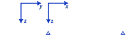
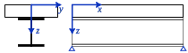
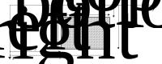
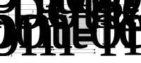
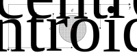
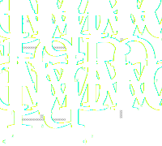
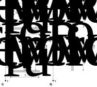
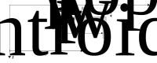

.. _examples.geometry:
Creating Geometries
*******************

.. _examples.geometry.basis:
The basics: Rectangle, Trapezoid and Circles
============================================
:py:class:`~m_n_kappa.Rectangle`, :py:class:`~m_n_kappa.Trapezoid`
and :py:class:`~m_n_kappa.Circle` are available as basis for creating
geometries.
In the following sections you learn how to create your own geometries
and what you have to consider.

.. _examples.geometry.basis.coordinates:
Directions and coordinates
--------------------------

   Axes

In `cartesian coordinates <https://en.wikipedia.org/wiki/Cartesian_coordinate_system>`_
the span direction is denoted as X-axis.

Y- and Z-axis are the cross-sectional plane.
Where the Y-axis is the horizontal axis and the Z-axis describes the
vertical axis.
The Z-axis is defined in reverse order, meaning from top to bottom.
Therefore, a higher value means a point at lower level.

.. seealso::
   :ref:`theory.coordinates` : Coordinates in the :ref:`theory`

.. _examples.geometry.basis.rectangle:
Rectangle and Trapezoid
-----------------------

   Rectangle dimensions

For a :py:class:`~m_n_kappa.Rectangle` as well as a :py:class:`~m_n_kappa.Trapezoid`
always the ``top_edge`` and the ``bottom_edge`` need to be defined.
The width and the horizontal positioning in Y-direction may be defined in
several ways.
All of the following are the same in size and position.

>>> from m_n_kappa import Rectangle
>>> rectangle_1 = Rectangle(
...     top_edge=0.0, bottom_edge = 10.0, width=10.0, left_edge=-5.0)
>>> rectangle_2 = Rectangle(
...     top_edge=0.0, bottom_edge = 10.0, width=10.0, right_edge=5.0)
>>> rectangle_3 = Rectangle(
...     top_edge=0.0, bottom_edge = 10.0, left_edge=-5.0, right_edge=5.0)
>>> rectangle_4 = Rectangle(
...     top_edge=0.0, bottom_edge = 0.0, width=10.0)

   Trapezoid dimensions

Defining the ``width`` and the horizontal position of a
:py:class:`~m_n_kappa.Trapezoid` is similar to the definition of
a Rectangle.
The only exception is that the definition must be conducted for the
``top_edge`` as well as for the ``bottom_edge``.

>>> from m_n_kappa import Trapezoid
>>> trapezoid_1 = Trapezoid(
...     top_edge=0, bottom_edge=10, top_width=10, bottom_width=20)
>>> trapezoid_2 = Trapezoid(
...     top_edge=0, bottom_edge=10, top_width=10, bottom_width=20,
...     bottom_left_edge=-10)
>>> trapezoid_3 = Trapezoid(
...     top_edge=0, bottom_edge=10, top_width=10, bottom_width=20,
...     bottom_right_edge=10)
>>> trapezoid_4 = Trapezoid(
...     top_edge=0, bottom_edge=10, top_width=10, bottom_left_edge=-10,
...     bottom_right_edge=10)

.. _example.geometry.basis.circle:
The Circle
----------
.. figure:: ../images/geometry_circle-dark.svg
   :class: only-dark

   Circle dimensions

>>> from m_n_kappa import Circle
>>> circle = Circle(diameter=10, centroid_y=10, centroid_z=-10)

.. _examples.geometry.compose:

The shortcut: composing geometries
==================================
Some geometries consisting of a number of basic geometries
may be used often like the I-profile.
Therefore, these often used geometries are provided as extra classes, like
:py:class:`~m_n_kappa.IProfile`, :py:class:`~m_n_kappa.UPEProfile` and
:py:class:`~m_n_kappa.RebarLayer`.

   I-Profile dimensions

The :py:class:`~m_n_kappa.IProfile` consist in general of a top-flange,
a web and a bottom-flange.
All of these elements are defined as :py:class:`~m_n_kappa.Rectangle`, but
may also be neglected as the Figure above shows.

>>> from m_n_kappa import IProfile
>>> i_profile_1 = IProfile(
...     top_edge=0., t_fo=15.5, b_fo=200.0, t_w=9.5, h_w=169.0)
>>> i_profile_no_topflange = IProfile(
...     top_edge=0., t_fo=15.5, b_fo=200.0, t_w=9.5, h_w=169.0,
        has_top_flange=False
... )
>>> i_profile_no_bottomflange = IProfile(
...     top_edge=0., t_fo=15.5, b_fo=200.0, t_w=9.5, h_w=169.0,
        has_bottom_flange=False
... )

   UPE-Profile dimensions

>>> from m_n_kappa import UPEProfile
>>> UPEProfile(top_edge=10, t_f=5.2, b_f=76, t_w=9.0, h=200)