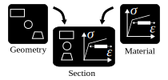
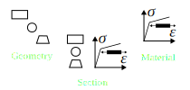

.. _examples.section:

Build a section
***************

A section is a merge of material and geometry.

   Creating a section

>>> from m_n_kappa import Steel, Rectangle
>>> steel = Steel(f_y=355.0)
>>> rectangle = Rectangle(top_edge=0.0, bottom_edge=10, width=10.0)

To create a :py:class:`~m_n_kappa.Section` you can choose one of the following ways.

The first way is by simply adding the ``steel`` (:py:class:`~m_n_kappa.Material` instance)
and a ``rectangle`` (:py:class:`~m_n_kappa.Geometry` instance) using the '+'-sign.

>>> section_1 = steel + rectangle
>>> section_1
Section(geometry=Rectangle(top_edge=0.00, bottom_edge=10.00, width=10.00, left_edge=-5.00, right_edge=5.00), material=Steel(f_y=355.0, f_u=None, failure_strain=None, E_a=210000.0))

Alternatively a section is created by passing ``rectangle`` and ``steel`` as arguments to
:py:class:`~m_n_kappa.Section`.

>>> from m_n_kappa import Section
>>> section_2 = Section(geometry=rectangle, material=steel)
>>> section_2
Section(geometry=Rectangle(top_edge=0.00, bottom_edge=10.00, width=10.00, left_edge=-5.00, right_edge=5.00), material=Steel(f_y=355.0, f_u=None, failure_strain=None, E_a=210000.0))

Both ways lead to exactly the same result.

>>> section_1 == section_2
True

Congratulations!
You have mastered to create a :py:class:`~m_n_kappa.Section`.
In :ref:`examples.cross_section` you will learn how to utilize this knowledge creating a
full cross-section.